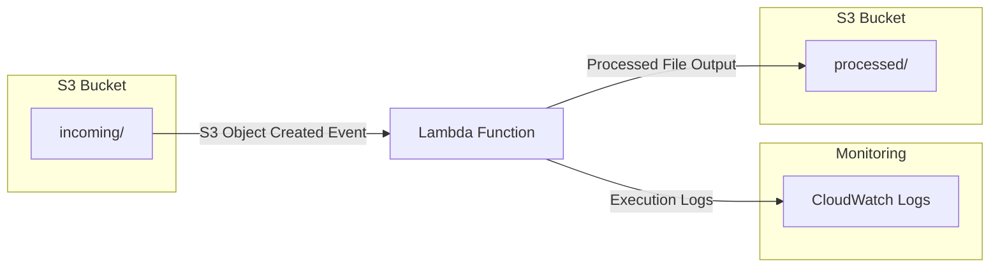
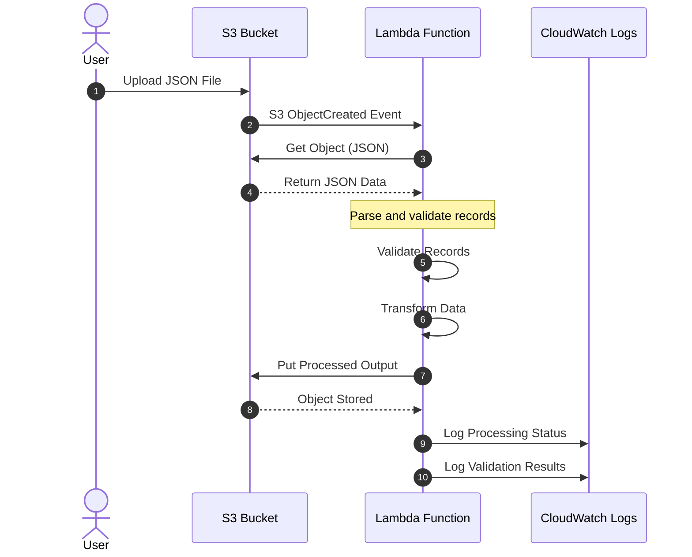
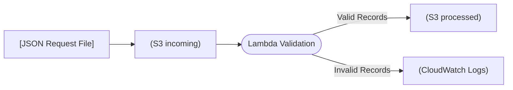

<!-- markdownlint-disable MD003 MD010 MD012 MD022 MD024 MD025 MD036 MD041 -->

# Assignment 2: Event-Driven Data Ingestion Pipeline

## Overview

Yarrow-Mullein Bank receives customer feedback and service requests from approved intake systems. Build an event-driven ingestion pipeline in which uploading a JSON request file to Amazon S3 triggers an AWS Lambda function that validates the file and writes a processed result to Amazon S3.

Note: You are allowed to use any tool to create the PDF report, but it must include all required screenshots and answers to reflection questions.

- A free online [Markdown-to-PDF converter](https://markdowntopdf.com/) is available.

- A free VS Code [Markdown-to-PDF extension](https://marketplace.visualstudio.com/items?itemName=yzane.markdown-pdf) is available.

- A free Chrome [Markdown viewer extension](https://chromewebstore.google.com/detail/documd-markdown-viewer/jekhhoflgcfoikceikgeenibinpojaoi) is available.

### Project Scenario

Yarrow-Mullein Bank receives service requests and customer feedback from multiple approved channels, but the current intake process is manual and inconsistent. Staff must review incoming JSON files, confirm the requested data is valid, and route the results to the appropriate downstream systems. The lack of automation slows response times and increases the risk of errors or incomplete records being processed.

As a member of the bank's Cloud Engineering team, you are tasked with building an event-driven ingestion pipeline that automatically processes uploaded files when they arrive in an S3 bucket. The solution must validate each incoming request, flag issues when data quality problems occur, and store the processed results in a structured workflow that can be reused by later application components. This assignment reflects a common enterprise workflow in which operational data needs to be validated and transformed as soon as it enters the platform.

## Learning Outcomes

Upon successful completion, you will be able to:

- Interpret a serverless architecture and its event flow.
- Create and configure an S3 event source for Lambda.
- Write a Lambda function that processes structured data.
- Store validated data in an S3 processing workflow.
- Test and document a cloud-based data pipeline.

## Diagrams

### Architecture Diagram



### Sequence Diagram



### Data Flow Diagram



## Repository Setup

The instructor will provide a GitHub repository template. Clone it, complete the supplied `README.md`, commit regularly, and push all work to GitHub. Your repository must remain accessible to the instructor until final grades are submitted.

## AWS Academy Learner Lab Note

AWS Academy Learner Lab does not allow you to create custom IAM roles or policies. Attach the pre-configured `LabRole` to your Lambda function instead of creating a custom execution role. `LabRole` already grants broad permissions, so you will not configure least-privilege S3/CloudWatch permissions yourself in this environment. The reflection questions ask you to describe the least-privilege configuration you would use outside the Learner Lab.

## Required Tasks

### Task 1: Create the Architecture

Create a private S3 bucket with `incoming/` and `processed/` prefixes. The Lambda function must read only from `incoming/` and write its results only to `processed/`.

S3 bucket names are globally unique, so name your bucket using the following pattern, replacing `<github-username>` with your own GitHub username (all lowercase):

```text
comp3020-f26a2-<github-username>
```

For example, a student with GitHub username `jsmith22` would create the bucket `comp3020-f26a2-jsmith22`.

**Required evidence:** S3 bucket settings and the folder structure.

### Task 2: Create the Lambda Function

Create a Python Lambda function that:

- Is invoked by an S3 object-created event.
- Reads a JSON file from the triggering bucket, formatted as `{"requests": [ ... ]}` (a JSON object with a `requests` array; do not accept a bare array as the top-level value).
- Validates that every service request contains `requestId`, `customerName`, `requestType`, and `createdAt`.
- Writes valid records to a processed JSON file in the `processed/` prefix.
- Logs invalid records and returns a useful summary.

Create and test your own data. Your two JSON files must contain at least **10 request objects total**, including at least 8 valid requests and at least 2 invalid requests. Use different values from the examples and make each `requestId` unique.

#### Structured JSON examples

Valid request object:

```json
{
  "requestId": "REQ-3001",
  "customerName": "Taylor Morgan",
  "requestType": "account-inquiry",
  "createdAt": "2026-09-10T09:15:00Z"
}
```

Invalid request object with a missing required field:

```json
{
  "requestId": "REQ-3002",
  "customerName": "Riley Chen",
  "requestType": "fraud-report"
}
```

Both files must use this top-level structure:

```json
{
  "requests": [
    {
      "requestId": "REQ-3001",
      "customerName": "Taylor Morgan",
      "requestType": "account-inquiry",
      "createdAt": "2026-09-10T09:15:00Z"
    }
  ]
}
```

Use the pre-configured `LabRole` as the Lambda function's execution role (AWS Academy Learner Lab does not allow creating custom IAM roles or policies).

**Required evidence:** Function configuration, source code, confirmation that `LabRole` is attached, and a successful test invocation.

### Task 3: Configure the S3 Trigger

Configure the bucket to invoke the Lambda function only for new `.json` objects uploaded to an `incoming/` prefix.

**Required evidence:** Trigger configuration and an architecture diagram showing the S3 upload event, Lambda function, and processed S3 output.

### Task 4: Test the Pipeline

An example valid file and an example invalid file are provided in `AssignmentExamples/Assignment2/sample-data/` to show the expected `{"requests": [ ... ]}` shape and field names. Do not submit these example files as your own test data — create your own `sample-data/valid-requests.json` and `sample-data/invalid-requests.json` with different values.

Upload your valid JSON file containing at least eight customer service requests. Confirm that the processed JSON output is written to S3. Upload your invalid JSON file containing at least two invalid requests (each missing or containing an empty required field) and confirm that the issues are recorded in CloudWatch Logs without preventing valid requests from being processed. Across both files, submit at least 10 request objects total.

When testing, also verify the negative cases:

- an object uploaded outside `incoming/` does not trigger processing;
- a non-`.json` object in `incoming/` does not trigger processing;
- a processed output object is written under `processed/` and does not trigger the function again.

If a negative case cannot be safely tested in the Learner Lab, document the expected behavior and explain how the prefix and suffix filters enforce it.

#### Required JSON data shape

Both input files must be valid JSON objects with a top-level `requests` array. Each request object should contain the required fields shown below:

```json
{
  "requests": [
    {
      "requestId": "REQ-3001",
      "customerName": "Taylor Morgan",
      "requestType": "account-inquiry",
      "createdAt": "2026-09-10T09:15:00Z"
    },
    {
      "requestId": "REQ-3002",
      "customerName": "Riley Chen",
      "requestType": "fraud-report",
      "createdAt": "2026-09-10T09:30:00Z"
    }
  ]
}
```

Create at least 10 request objects across the valid and invalid files. Use your own names, timestamps, request IDs, and request types; do not submit the example values unchanged.

Minimum data requirement:

- at least 8 valid request objects in `valid-requests.json`;
- at least 2 invalid request objects in `invalid-requests.json`;
- each invalid object must be missing or have an empty required field;
- every `requestId` must be unique.

The processed output must contain the valid records and enough metadata to identify the source object. The exact field order is not graded, but the output must be valid JSON and the invalid records must be visible in CloudWatch Logs.

If the JSON is malformed, the top-level `requests` array is missing, or the event key is outside `incoming/`, document the observed or expected failure and the safe handling decision.

**Required evidence:** Input files, processed output file, and relevant CloudWatch log output.

### Task 5: Reflection Questions

Answer these questions in your `README.md`:

1. What event causes the Lambda function to run?
2. Why should the function validate a customer service request before creating the processed output?
3. This assignment uses the pre-configured `LabRole`, which grants broader permissions than needed. What S3 and CloudWatch permissions would a least-privilege Lambda execution role require in a real (non-Learner-Lab) AWS account, and why?
4. How would you prevent the Lambda function from being triggered by its own output files?
5. If you were deploying this pipeline outside AWS Academy Learner Lab, what IAM policy statements (actions and resources) would you write for the execution role, and how would you scope them to only the `incoming/` and `processed/` prefixes?

The fifth question is required even though the Learner Lab uses the broader pre-configured `LabRole`.

## Repository Requirements

Your repository must contain:

- `README.md` with your name, completion date, architecture diagram, evidence, and reflection answers.
- `src/` with the Lambda source code.
- `sample-data/` with the valid and invalid JSON files used for testing.
- `screenshots/` with all referenced evidence.

Do not commit credentials, access keys, or secrets.

## Submission Requirements

Submit to LEARN:

1. A PDF export of the completed `README.md`.
2. The URL of your GitHub repository.

## Rubric (10 Marks)

| Criteria                        | Master (2)                                                                                | Novice (1)                                                                        | Try Again (0)                                                               |
| ------------------------------- | ----------------------------------------------------------------------------------------- | --------------------------------------------------------------------------------- | --------------------------------------------------------------------------- |
| Repository and documentation    | Repository is accessible, organized, and README contains complete evidence and answers.   | Repository is accessible but documentation or evidence has minor gaps.            | Repository is inaccessible, incomplete, or lacks required documentation.    |
| Cloud resources and security    | S3 prefixes are correctly configured and `LabRole` is correctly attached to the function. | Resources work but contain minor configuration issues.                            | Required resources or `LabRole` attachment are missing or incorrect.        |
| Lambda implementation           | Function correctly reads, validates, logs, and writes valid JSON output.                  | Function handles the main flow but has minor validation or error-handling issues. | Function does not process records successfully.                             |
| Event integration and testing   | Correct prefix/suffix trigger is configured; valid and invalid cases are demonstrated.    | Trigger and one test case work, with incomplete filtering or test evidence.       | Trigger is absent, misconfigured, or tests do not demonstrate the pipeline. |
| Reflection and evidence quality | Answers are accurate and evidence clearly proves each requirement.                        | Most answers and evidence are present but lack detail or clarity.                 | Reflection is incomplete or evidence cannot verify the work.                |

## Important

Your repository must remain accessible to the instructor until final grades have been submitted.

Overall Performance Levels

| Level     | Score |
| --------- | ----- |
| Master    | 9-10  |
| Novice    | 7-8   |
| Try Again | 0-6   |

## Academic Integrity

Complete the work in your own AWS Learner Lab environment. Submitted code, screenshots, documentation, and explanations must accurately represent your own work and understanding.
